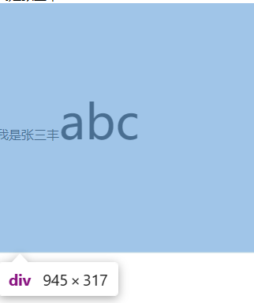

# 中心论之垂直居中
>**引子：** 我就好像有大病，每次都想着放中间，稍稍有一点偏差就不顺心，折磨人心，思来想去还是想研究一番居中，接着论垂直居中。

## line-height
总所周知，只要设置了`line-height`，不仅可以有了高度，而且还能让里面的文字垂直居中，可谓一举两得啊，但真实的html结构并没有那么简单：
> 1. 首先第一种情况：**div设置了`line-height`，但span的`font-size`不与div的`font-size`一致**：

```
 <div style="line-height: 300px; font-size: 16px">
    我是张三丰<span style="font-size: 60px">abc</span>
  </div>
```
### 效果图


### 感悟
经过大量实验，当div的`font-size`和span的`font-size`一致时，可以得到`line-height`的高度，推测是因为span的高度并不是`line-height`的高度，
所以为了保证正确，应该在使用`line-height`的同时使用`height`来保障div的高度，而且我们也知道，所谓的垂直居中也只是模糊的的，并不完是。
